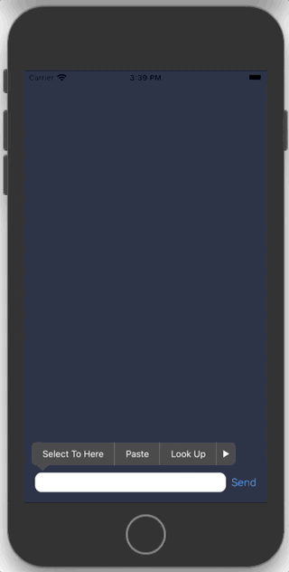

# Client Sentiment Analyzer

    
    
    

### About

Tiny app to check client sentiment based on product review 💸.

Core ML model has been taught using 12 000 client reviews from Amazon US marketplace, category: Toys.

### Contents

##### 🧸 Client Sentiment Xcode Project
[`Client-Sentiment-Analysis.xcodeproj`](Client-Sentiment-Analysis.xcodeproj)

A simple application written using `SwiftUI` to demonstrate the operation of a created neural network model. The project contains the learned AI model, which was created using `Create ML`.
App is ready to use on newer versions of MacOS, iPadOS and iOS. 
Scales well to the screen aspect ratio

##### ✂️ Jupyter Notebook
[`client_sentiment.ipynb`](client_sentiment.ipynb)

This notebook contains Python script to prepare records stored in .csv file using `Pandas` library.
Every record then is stored in separate .txt file, to suit `Create ML` demand.

The data I used is available at [`Amazon Customer Reviews Dataset`](https://s3.amazonaws.com/amazon-reviews-pds/readme.html) webpage. 

##### 🏗 Model Generator
[`ClientSentimentClassifier.mlproj`](ClientSentimentClassifier.mlproj)

Apple `Create ML` project to generate text classifier model.

Model in project has been trained using 12 000 records classified from range 1 - 5, validated with 4 000 records and tested with 4 000 others. At first glance, the model may seem poorly taught, but after a deeper diagnosis, it can be concluded that about 90% of the answers are well classified or classified into an adjacent class. Even a human 💁‍♂️ would have a problem with the correct classification of the review and the person who wrote this review may not have given the number of stars consistent with the opinion. 

To sum up, the model works very well - try it!

##### 🔎 Model Checker
[`checkTraining.playground`](checkTraining.playground)

A simple playground to check how many % of queries the model has classified correctly and one class more or less.

### Usage

1. Clone repository
2. Prepare your own dataset with `star_rating` and `review_body` columns.
3. Sieve data using `Python` script.
4. Generate `Core ML` model.
5. Import it to the app.
6. Have fun!
